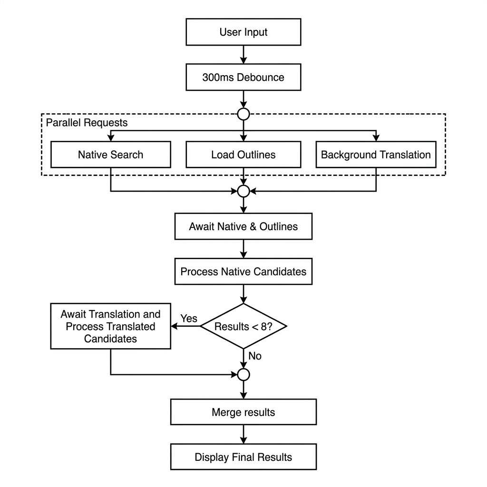

# Search and match pipeline

When a user types in the search box, `useWikidataSearch` debounces the input and fires the following requests in parallel:

1. **`searchWikidata`** hits the MediaWiki `action=query&list=search` API (backed by CirrusSearch on Wikidata.org, the same engine as the Wikidata website) and returns up to 20 candidate entities as Q-IDs.
2. **`store.loadOutlines()`** fetches (or returns its cached copy of) the configured outlines from the local `/articleguidance/v1/outlines` REST endpoint. Each outline declares one or more article types in an `articleTypes` array, each entry a Wikidata Q-ID with an optional `matchVia` property (e.g. `P106` for occupations, `P171` for biological taxa, or defaulting to `P31` instance-of).
3. **`searchViaTranslation`** (only if the query contains a non-Latin script) preemptively translates the search query to a target language (like English) using MinT (`translateQuery`) and searches Wikidata with the translated query in the background.

Using CirrusSearch means queries like "Titanic film" match entities whose label is "Titanic" and whose description contains "film", mirroring the results users see on Wikidata.org.

## Processing and Match Flow

Once both the native Wikidata search and the outlines load complete, the native results are processed first:

1. **`fetchEntityClaims`** — a single `wbgetentities` call fetches the relevant claims (P31, P106, P171, P18, sitelinks, etc.) and the labels and descriptions (in the user's language) for the candidate Q-IDs at once.
2. **`checkItemHierarchyMatches`** — fires one SPARQL query per outline group against the Wikidata Query Service, all in parallel. Each query uses the candidate Q-IDs directly as `VALUES ?item` and traverses the appropriate property path: `wdt:P31/wdt:P279+` for default groups, `wdt:P106/wdt:P279+` for occupation groups, `wdt:P171+` for taxon groups, and `wdt:P31/wdt:P279*` for the configured excluded item types. Results are returned as an item-keyed map: `{ groupKey: { itemQId: Set<outlineQId> } }`.

Both `fetchEntityClaims` and `checkItemHierarchyMatches` maintain page-scoped in-memory caches (cleared on page reload) to avoid redundant requests.

## Translation Fallback

If the number of processed native results is less than 8 (`MAX_RESULT`), the translation fallback flow is executed:

1. We await the parallel `translationSearchPromise` results.
2. We de-duplicate translation results by filtering out candidates that were already present in the native Wikidata search results.
3. If there are new translation candidates, we process them separately through the same entity claims fetching and SPARQL matching pipeline.
4. Finally, the processed native and translation results are merged (with supported native/translation results first, followed by unsupported native/translation results).

## Candidate Filtering and Matching

Zero-hop matches are resolved from the `wbgetentities` data in JavaScript: if a candidate's Q-ID is itself one of an outline's article-type Q-IDs, or if its direct P31 value is one, it is recorded without touching the SPARQL results. The SPARQL results (1+ hops only, since `+` is used rather than `*`) are then merged in by `applyHierarchyMatches`, which does a direct item→outline lookup from the item-keyed map.

Items are filtered out before matching if their P31 value is a configured excluded type (direct check via `wbgetentities`) or if the SPARQL exclusion query (`P31/wdt:P279*`) found a match.

Finally, `selectBestMatches` resolves ambiguity when a candidate matches multiple outlines: it first prefers outlines matched via a non-default `matchVia` strategy (preventing a broad type like Q5/human from drowning out a specific occupation match), then among survivors keeps only the highest-`hierarchyDepth` match, which corresponds to the most specific outline in the configured taxonomy.
